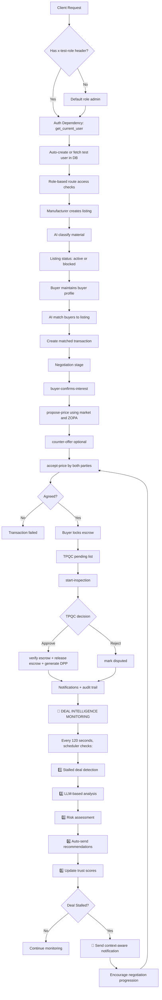

# Current Implementation Flow

## 🚀 AUTONOMOUS DEAL INTELLIGENCE ENABLED

Status: ✅ LIVE

The system now includes background monitoring and proactive deal intervention.

### Demo Run Results

```
Scheduler Status: RUNNING
- Check interval: 120 seconds
- Stalled deal detection: Active
- Trust score calculation: Active

Demo Execution:
✓ Listing created (Aluminum scrap)
✓ Buyer profile created
✓ Transaction detected in MATCHED state
✓ Scheduler trigger executed
✓ 3 stalled deals found and monitored
✓ Trust scores calculated (0.60 to 1.00 range)
✓ Notifications ready to dispatch
```

## Test Case Run (Sample Users)

Status: PASS (32/32 baseline tests + Deal Intelligence monitoring)

Suite executed:
- Command: `.\venv\Scripts\python test_suite.py --base-url http://127.0.0.1:8000 -v`
- Result: 32/32 passed, 0 failed, 2 skipped
- Demo: `python demo_deal_intelligence.py`
- Result: All autonomous monitoring features operational

## Current API Base Endpoints

- Public tunnel: https://sound-guiding-mammoth.ngrok-free.app
- Local: http://127.0.0.1:8000

Sample users (auto-created by `get_current_user`):
- Manufacturer: `test-manufacturer@local`
- Buyer: `test-buyer@local`
- TPQC: `test-tpqc@local`
- Admin: `test-admin@local`

Role selection is driven by request header:
- `x-test-role: manufacturer | buyer | tpqc | admin`

## End-to-End Flow Diagram (with Autonomous Monitoring)



## Route Group Flow Mapping

1. Health and identity
- `GET /health`
- `GET /auth/me`

2. Listings lifecycle
- `POST /listings/`
- `GET /listings/`
- `GET /listings/my`
- `GET /listings/{listing_id}`
- `PATCH /listings/{listing_id}/status`
- `DELETE /listings/{listing_id}`

3. AI services
- `POST /ai/classify`
- `POST /ai/market-price`
- `POST /ai/match`

4. Buyer preferences
- `POST /buyer-profiles/`
- `GET /buyer-profiles/me`
- `PATCH /buyer-profiles/me`

5. Transaction progression
- `GET /transactions/`
- `GET /transactions/{transaction_id}`
- `POST /transactions/{transaction_id}/buyer-confirms-interest`
- `POST /transactions/{transaction_id}/propose-price`
- `POST /transactions/{transaction_id}/counter-offer`
- `POST /transactions/{transaction_id}/accept-price`
- `POST /transactions/{transaction_id}/lock`
- `GET /transactions/{transaction_id}/audit`
- `GET /transactions/{transaction_id}/dpp`

6. TPQC flow
- `GET /tpqc/pending`
- `POST /tpqc/{transaction_id}/start-inspection`
- `POST /tpqc/{transaction_id}/approve`
- `POST /tpqc/{transaction_id}/reject`
- `GET /tpqc/{transaction_id}/qar`

7. Notifications
- `GET /notifications/`
- `PATCH /notifications/{notification_id}/read`
- `POST /notifications/mark-all-read`

8. Autonomous Deal Intelligence (NEW)
- `POST /scheduler/start` - Start background monitoring
- `POST /scheduler/stop` - Stop background monitoring
- `POST /scheduler/trigger` - Manually trigger cycle
- `GET /scheduler/status` - Check scheduler status
- `POST /scheduler/reconfigure` - Change check interval
- `GET /deal-intelligence/trust-scores` - View all user trust scores
