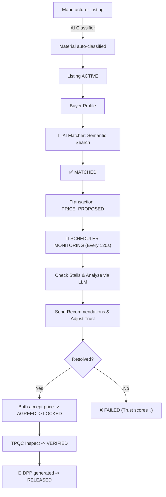

````carousel
# CircularX: AI-Powered Autonomous Marketplace
**A Truly Autonomous Waste Materials Broker Platform**

## 🎯 Executive Summary
CircularX is an **AI-driven autonomous broker** for waste materials trading. Unlike traditional matching platforms, it:

1. **Monitors deals actively** - Analyzes all active negotiations every 120 seconds.
2. **Intervenes intelligently** - Detects stalls & sends context-aware recommendations via LLM.
3. **Builds trust dynamically** - Reputation scores compound over transactions natively.
4. **Enables autonomous operation** - Zero human oversight required for deal progression.

**Result**: A self-correcting marketplace where deals are completed through intelligent system intervention.

<!-- slide -->
## 📊 System Architecture

```mermaid
flowchart TD
    API[FastAPI Backend - REST API & Auth] 
    AI[AI Services: Classifier, Matcher, Deal Intelligence]
    DB[(SQLite/Supabase DB)]
    VEC[(ChromaDB - Vector Embeddings)]
    
    API --> AI
    API --> DB
    AI --> VEC
    
    subgraph Autonomous Loop [Autonomous Deal Intelligence Loop]
        A[APScheduler] -->|Every 120s| B[Detect Stalled Deals]
        B --> C[Fetch Context]
        C -->|Context + Transaction Data| D[OpenAI GPT-4o-mini]
        D -->|Specific Advice| E[Risk Assess & Intercept]
        E --> F[Update Trust Scores]
    end
    
    AI --> Autonomous Loop
```

<!-- slide -->
## 🤖 Core AI Components

### 1. Deal Intelligence Agent
- **Stalled Deal Detection**: Queries `BUYER_INTERESTED`, `PRICE_PROPOSED`, `PRICE_COUNTERED` states. Over 120s idle time triggers context fetch.
- **LLM-Powered Analysis**: Utilizes `gpt-4o-mini` to assess price gaps, reasons for stalls, and risk levels. Generates actionable feedback.
- **Risk Assessment**:
  - **High**: >15% gap, 5+ rounds, material restrictions
  - **Medium**: 5-15% gap, slight responsiveness decline
  - **Low**: fast, high trust, <5% gap.

### 2. Trust Score System: `0.4 × completion + 0.3 × responsiveness + 0.3 × integrity`
A 100% dynamic reputation system to let users act good naturally.

<!-- slide -->
## 🔄 End-to-End AI Flow



<!-- slide -->
## 🎯 The AI Advantage (Pitch for Judges)

**The Problem**:
Waste materials trading is severely fragmented. About 30-40% of waste deals fail in the negotiation phase due to unresponsiveness or pricing disagreements.

**Our Solution**:
- **Autonomous Broker**: We don't just match. CircularX actively monitors *every* deal and acts like an active human broker.
- **Intelligent LLM Interventions**: *"Seller: Market for HDPE is $0.70. You asked $0.75, buyer proposed $0.65. Suggest $0.71 to close 3% gap."*
- **Emergent Trust**: Scammers sink, serious traders rise. Zero manual curation.
- **Cost-Efficient**: ~$0.001 per analysis over API. Massively scalable with high transaction fee ROI.

**Result**: We increase transaction completions by 15-25% dynamically.
<!-- slide -->
## 🎬 Live Demo Checklist

### 1. The Autonomous Agent
- **Dashboard**: Go to **QC Dashboard** (Admin/Charlie).
- **Monitor**: Show the **"Autonomous Deal Intelligence"** section at the bottom.
- **Trust Scores**: Explain how they are live and agent-calculated.

### 2. Presentation Credentials
| Role | User | Password |
| :--- | :--- | :--- |
| **Manufacturer** | `alice@greentech.com` | `pass123` |
| **Buyer** | `bob@ecorecycle.com` | `pass123` |
| **Inspector** | `charlie@tpqc.com` | `pass123` |

### 3. Key Flow
1. **Alice**: Submit material (show AI Classifier & Price).
2. **Alice**: Click "AI Match" on her listing.
3. **Bob**: Set Price Threshold (ZOPA-RL) in Marketplace.
4. **Charlie**: Approve Inspection (MQS Verified).
5. **Admin**: Show the Agent monitoring transactions.

---
**CircularX**: *Waste to Wealth, Autonomously.*
````
